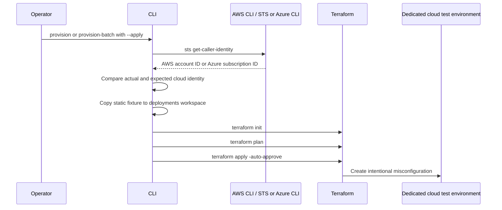

# Terraform Misconfiguration Generator Architecture

## Purpose

This application provisions intentionally misconfigured AWS and Azure resources
for CSPM and CIEM test scenarios. It uses reviewed, prebuilt Terraform fixtures
and does not read private cloud-security-feed JSON at runtime.

## Architecture

```mermaid
flowchart LR
    Operator["Operator"] --> CLI["Python CLI\nsrc.cli"]
    CLI --> Catalog["Scenario catalog\nsrc.scenarios"]
    Catalog --> Fixtures["Static Terraform fixtures\nterraform_scenarios/rules/<rule-id>"]
    CLI --> Identity["AWS CLI / Azure CLI\nAccount or subscription verification"]
    Identity --> Cloud["Dedicated AWS account\nor Azure subscription"]
    CLI --> Workspace["Deployment workspace\ndeployments/<scenario-id>/<rule-id>"]
    Fixtures --> Workspace
    Workspace --> Terraform["Terraform init / plan / apply or destroy"]
    Terraform --> Cloud

    Feed["Private JSON feeds\nCSPM / CIEM"] -. maintainer-only build .-> Templates["Reviewed templates\nsrc.templates"]
    Templates -. build_static_scenarios.py .-> Fixtures
```

## Components

| Component | Responsibility |
| --- | --- |
| `src/cli.py` | Parses commands, verifies the cloud identity, copies fixtures, and invokes Terraform. |
| `src/scenarios.py` | Maps friendly scenario IDs to static Terraform rule directories and module/service metadata. |
| `terraform_scenarios/rules/` | Portable static scenario repository. Each rule directory contains `main.tf` and a README. |
| `deployments/` | Per-scenario Terraform working directories and local state. This is created at deployment time. |
| `src/templates.py` | Maintainer source for reviewed fixture definitions; it is not used at runtime. |
| `tools/build_static_scenarios.py` | One-time maintainer exporter that rebuilds the static fixture repository. |

## Provisioning flow



`destroy` and `destroy-batch` repeat the cloud identity check, then run
`terraform destroy -auto-approve` only against workspaces with local Terraform
state.

## Supported CLI commands

Run all commands from `terraform_misconfig_generator`.

| Command | Purpose |
| --- | --- |
| `list` | Lists raw static fixture rule IDs, or catalog entries when filtered by module/service. |
| `scenario-list` | Lists friendly scenario catalog entries. |
| `describe <scenario-id>` | Shows scenario metadata and its backing rule ID. |
| `generate <rule-id>` | Copies one static fixture to an output directory. |
| `generate-all` | Copies all static fixtures to an output directory. |
| `deploy <rule-id>` | Deploys a fixture directly by rule ID. |
| `provision <scenario-id>` | Deploys one friendly scenario ID. |
| `provision-batch` | Deploys all matching CSPM or CIEM scenarios, optionally filtered by service. |
| `destroy <scenario-id>` | Destroys one previously deployed scenario. |
| `destroy-batch` | Destroys all deployed scenarios matching a module/service filter. |

### Discovery commands

```powershell
python -m src.cli list --module CSPM
python -m src.cli list --module CSPM --service S3
python -m src.cli list --module CSPM --services
python -m src.cli list --module CIEM --service IAM
python -m src.cli describe cspm-aws-ec2-open-public
```

### Single-scenario lifecycle

```powershell
python -m src.cli provision cspm-aws-ec2-open-public --region us-east-1 --expected-account-id <12-digit-test-account-id> --apply
python -m src.cli destroy cspm-aws-ec2-open-public --region us-east-1 --expected-account-id <12-digit-test-account-id> --apply
```

### Batch lifecycle

```powershell
python -m src.cli provision-batch --module CSPM --service S3 --region us-east-1 --expected-account-id <12-digit-test-account-id> --apply
python -m src.cli destroy-batch --module CSPM --service S3 --region us-east-1 --expected-account-id <12-digit-test-account-id> --apply

python -m src.cli provision-batch --module CIEM --service IAM --region us-east-1 --expected-account-id <12-digit-test-account-id> --apply
python -m src.cli destroy-batch --module CIEM --service IAM --region us-east-1 --expected-account-id <12-digit-test-account-id> --apply
```

For RDS and Aurora scenarios, set a password for the current PowerShell
session before provision or batch provision:

```powershell
$env:TF_VAR_db_password = "Use-a-unique-disposable-test-password"
```

## Features and safety controls

- Static fixtures can be published separately without private feed JSON.
- Friendly scenario IDs support the `CSPM` and `CIEM` modules.
- Service filtering supports the catalog services, including EC2, S3, RDS, VPC, and IAM.
- The CLI requires `--apply` before cloud changes.
- AWS STS verifies the exact 12-digit account ID before every AWS deploy or destroy operation.
- Azure CLI verifies the exact subscription ID before every Azure deploy or destroy operation.
- Terraform is run with `plan` before `apply`; apply and destroy are non-interactive after the explicit CLI acknowledgement.
- Fixture resources are inert by default through `allow_unsafe_apply = false`.
- Terraform state is separated from reusable fixture source under `deployments/`.
- Batch commands run sequentially and stop at the first failed scenario.

## Prerequisites and operational limits

- For AWS scenarios, install AWS CLI, authenticate to a dedicated test account, and confirm `aws sts get-caller-identity` succeeds.
- For Azure scenarios, install Azure CLI, authenticate to a dedicated test subscription, and confirm `az account show` succeeds.
- Install Terraform and ensure it is on `PATH`.
- Run only in a disposable AWS account or Azure subscription; scenarios intentionally weaken security controls.
- AWS Organizations SCPs, account-level S3 Block Public Access, service quotas, and regional resource availability can prevent a scenario from deploying.
- Some feed rules are intentionally not implemented because they depend on AWS usage history, external VPN tunnel telemetry, retired EC2-Classic behavior, or other state Terraform cannot create deterministically.
